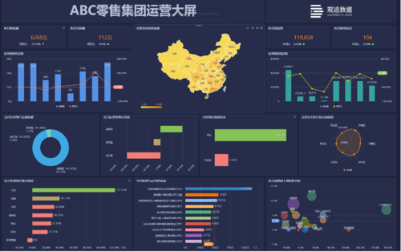
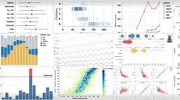
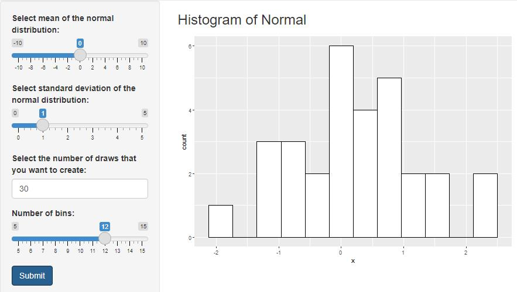
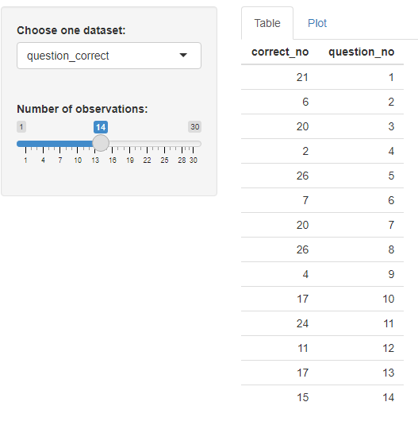
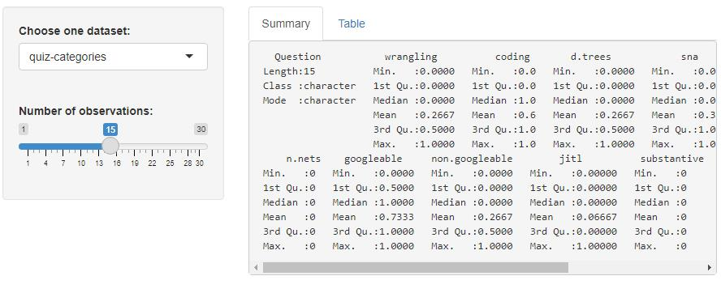
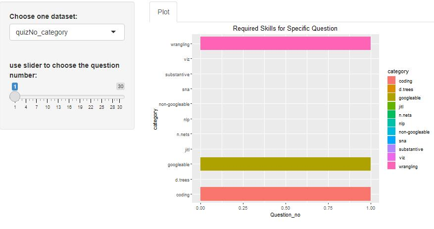
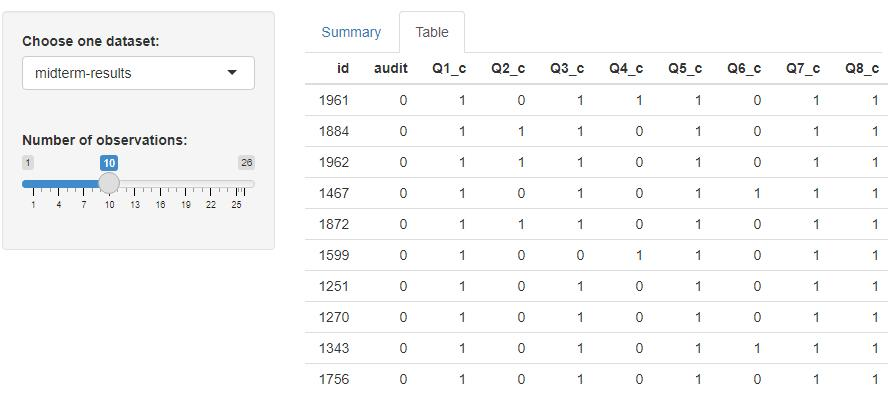

# Interactive-Visualization-
Interactive visualization is becoming a more prominent feature of reporting. Business analytics packages tend to stress the ease eith which data can be played with by non-experts. Allowing students to explore aspects of complex data rather than simply telling them what you see can be a powerful tool for learning as explored in the readings. Within the RStudio universe this functionality is accomplished through the Shiny ecosystem. A web-app designing interface that allows web-apps to be built from within R with limited knowledge of javascript or html.

In this project, I will use the two datasets midterm-results.csv and quiz-categories.csv to do interactive visualizations.

## Random Histogram Generator
We will build a Shiny App one piece at a time. This app will generate a histogram based on random values drawn from a normal distribution, the user will be able to select the number of draws that generate the histogram by typing the number of the draws. Also, the users can user the slider to choose how many bins that you want to see from this UI.

**You can set your own mean or standard deviation and drag the slider to choose how many bins that you want to see. Also, you can decide how many draws you want**

## Interactive Visualization graphs for students' tests

Finally, I build an interactive visualization using the data sets quiz-categories.csv and midterm-results.csv. These data represent midterm results from an open book test. Deploy your dashboard to the Shiny Apps hosting service. 

The categories represent the skills required to answer each question:

wrangling - Question required data manipulations skills  
coding - Question required coding skills  
d.trees - Question invoilved decision trees  
sna - Question involved social network analysis  
nlp - Question involved natural language processing  
viz - Question involved visualization of data  
n.nets - Question involved neural nets  
googleable - Question could be answered by searching the internet  
non-googleable - Question could not be answered through simple searching of the internet  
jitl - Question involved learning somethimg new (just in time learning)  
substantive - Question involved wrestling with a complex idea that does not have a definitive answer

I create four categories, and I will show them separately. Each category has two tab buttons and you can choose any one of them. Also, you can use slider to show the number of the items that you want to see :

**Question_Correct**

You can use slider to choose the how many quesions that you want to see and the correct number respectively.

**quiz_categories**

**Question_category**

Use the slider to choose which question that you want to see.

**midterm results**

Use the slider to choose how many students that you want to see. Then you can see each student with their correct questions.

## Relevant Materials

[Shiny Apps Documentation](https://shiny.rstudio.com/)

[Shiny Gallery](https://shiny.rstudio.com/gallery/)

[Verbert, K., Duval, E., Klerkx, J., Govaerts, S., & Santos, J. L. (2013). Learning Analytics Dashboard Applications. American Behavioral Scientist, 57(10), 1500–1509.](https://journals.sagepub.com/doi/abs/10.1177/0002764213479363)
